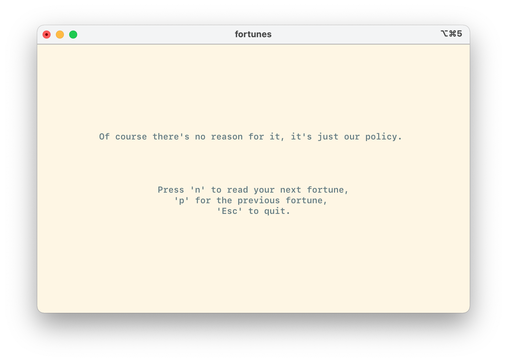

# Fortunes

A simple wrapper around the "fortune" command which allows you to view many
fortunes easily and elegantly. Well, as elegantly as you can in a terminal that
is.



## Installation

Make sure you have the
[fortune](https://www.ibiblio.org/pub/linux/games/amusements/fortune/!INDEX.html)
command installed (typically as easy as `brew install fortune`) and available in
your `PATH`.

### Using Stack

```sh
git clone git@github.com:sequoiasnow/fortunes.git && cd fortunes
stack install
```

### From GitHub

If you're working on a Mac, simply download the latest release from [the
releases page](https://github.com/sequoiasnow/fortunes/releases)
